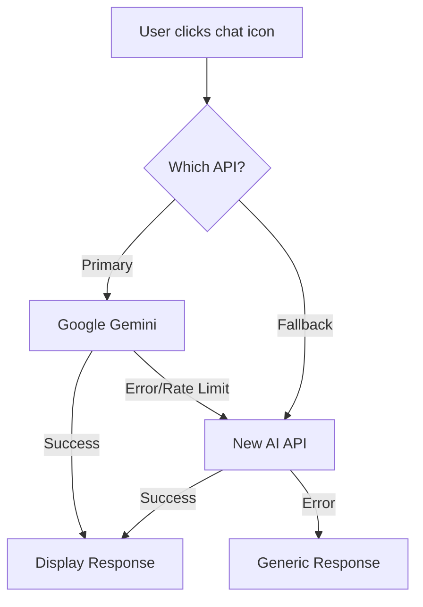
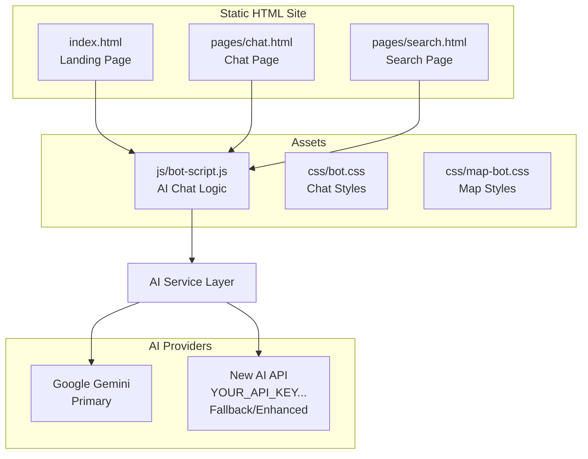

# AI Integration Plan for Windsor Static Landing Page

## Focus: Static HTML/CSS Site (Not React/Node)

Your API key (`YOUR_API_KEY_HERE`) can add AI capabilities to your static landing page.

---

## Current State Analysis

| Component                                             | Status           | AI Opportunity            |
| ----------------------------------------------------- | ---------------- | ------------------------- |
| [`index.html`](index.html:1) - Landing page           | Static HTML      | Chat widget, smart search |
| [`css/bot.css`](css/bot.css:1) - Bot styles           | Existing         | Chat widget styling       |
| [`js/bot-script.js`](js/bot-script.js:1) - Bot script | Future           | AI-powered chat           |
| `pages/chat.html`                                     | ❌ Doesn't exist | **Needs to be created**   |
| `pages/search.html`                                   | ❌ Doesn't exist | **Needs AI search**       |

---

## AI Integration Opportunities for Static Site

### 1. 🤖 AI Chat Bot Widget (HIGHEST PRIORITY)

**Target:** Add to [`index.html`](index.html:1) and create [`pages/chat.html`](pages/chat.html:1)

Your [`bot-script.js`](js/bot-script.js:1) already has:

- Google Gemini integration
- Room context awareness
- Quick replies system
- Typing indicators

**Enhancement with new API:**

- Backup/failover AI provider
- Better natural language understanding
- Multi-language support



---

### 2. 🔍 AI-Powered Search Page

**Target:** Create [`pages/search.html`](pages/search.html:1) with AI search

**Features:**

- Natural language queries: "cozy room under 15k near BGC"
- Conversational search refinement
- Smart filter suggestions
- Voice input support

---

### 3. 🎯 Smart Recommendations on Homepage

**Target:** Enhance [`index.html`](index.html:1) "AI Recommendations" section (line 414-416)

**Current:** "Our Optibot learns your preferences to suggest properties you'll love."

**Enhanced with AI:**

- Real-time preference learning
- Personalized property cards
- "Recently viewed" intelligent suggestions

---

### 4. 💬 Smart Contact/Inquiry Form

**Target:** Enhance inquiry form in [`index.html`](index.html:1)

**AI Features:**

- Auto-categorize inquiry type (booking/viewing/pricing)
- Sentiment detection for urgent messages
- Smart auto-responses for common questions
- Response time estimation

---

## Recommended Architecture



---

## Implementation Priority

### Phase 1: Deploy Existing Chat Widget

- [ ] Add chat widget embed code to [`index.html`](index.html:1)
- [ ] Create [`pages/chat.html`](pages/chat.html:1) with full chat interface
- [ ] Configure API keys in [`bot-script.js`](js/bot-script.js:1)

### Phase 2: Create AI Search Page

- [ ] Create [`pages/search.html`](pages/search.html:1)
- [ ] Add natural language search input
- [ ] Integrate AI for query understanding

### Phase 3: Smart Homepage Features

- [ ] Implement "Optibot" recommendation section
- [ ] Add AI-powered inquiry form
- [ ] Personalized property suggestions

---

## API Key Configuration

In [`bot-script.js`](js/bot-script.js:1), line 3-4:

```javascript
const apiKey = "AIzaSyCzwz4puVfYrahJciYecD2jxKROB8ZQpY"; // Primary - Gemini
const fallbackApiKey = "YOUR_API_KEY_HERE"; // New AI
```

---

## Key Questions

1. **Do you want the chat widget embedded in the homepage ([`index.html`](index.html:1)) or a separate page?**
2. **Should I create the `pages/chat.html` and `pages/search.html` pages?**
3. **Which specific AI features are most important to you?**
   - AI Chat (customer support)
   - AI Search (natural language property search)
   - AI Recommendations (personalized suggestions)

---

## Files to Create/Modify

| File                                     | Action     | Purpose                       |
| ---------------------------------------- | ---------- | ----------------------------- |
| [`index.html`](index.html:1)             | Modify     | Add chat widget embed         |
| [`js/bot-script.js`](js/bot-script.js:1) | Modify     | Add new API, enhance AI logic |
| [`css/bot.css`](css/bot.css:1)           | Modify     | Customize chat appearance     |
| `pages/chat.html`                        | **CREATE** | Dedicated chat page           |
| `pages/search.html`                      | **CREATE** | AI-powered search page        |
